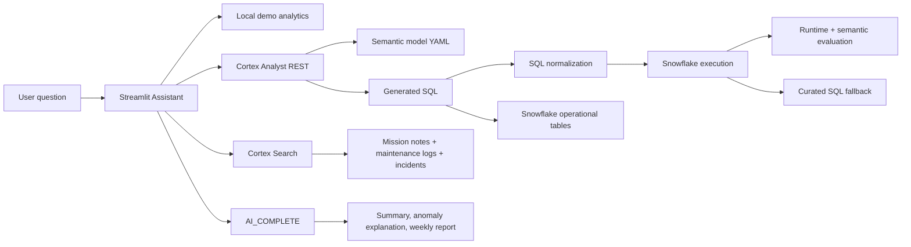

# Snowflake Cortex Unit Operations AI Assistant

An AI-powered natural-language analytics assistant for unit operations data. The app lets users ask questions about mission performance, aircraft readiness, personnel availability, maintenance issues, incident reports, and parts risk.

The project goes beyond a basic natural-language-to-SQL demo. It shows how to make AI-generated analytics more transparent, testable, and trustworthy with generated SQL visibility, runtime evaluation, semantic quality checks, fallback handling, and cost/latency-aware design.

Example questions:

- Which unit had the highest mission success rate last month?
- Summarize delayed missions and likely causes.
- Find anomalies in aircraft readiness.
- Generate a weekly unit operations report.
- Which parts or supplies are creating operational risk?

## Why This Project Is Strong

This is more than a dashboard. It combines analytics, retrieval, natural-language-to-SQL, and AI-generated operational reporting inside the Snowflake ecosystem.

It demonstrates:

- Snowflake Cortex AI SQL with `AI_COMPLETE`
- Cortex Analyst for natural-language-to-SQL over a semantic model
- Cortex Search for retrieval over maintenance logs, mission notes, and incident reports
- Snowpark/Python and Snowflake connector integration
- Streamlit UI for chat, KPIs, charts, evidence, and generated reports
- Runtime evaluation for route, latency, execution status, semantic quality, and fallback behavior
- No-cost evaluation checks that run after an answer is generated without issuing extra Snowflake queries
- Cortex SQL normalization and curated SQL fallback for reliability
- SQL data modeling for missions, readiness, personnel, incidents, and parts inventory
- Testable local demo mode for portfolio reviews without Snowflake credentials

## Architecture



## Core Features

- Chat interface with example questions
- KPI cards for top unit, success rate, delays, anomalies, risk, and personnel availability
- Mission performance chart
- Aircraft readiness chart
- Operational risk scoring by unit
- Evaluation tab with route, latency, semantic quality score, fallback status, and pass/review checks
- Semantic quality checks for intent classification, expected metrics, grounding, and question relevance
- Five-minute cache for repeated Snowflake questions during demos
- Evidence panels for maintenance logs, incident reports, parts inventory, and delayed missions
- Generated SQL/query-plan panel for transparency
- Downloadable latest answer/report
- Demo mode and Snowflake mode
- Optional Cortex Analyst REST integration with `SNOWFLAKE_PAT`
- Snowflake-native Streamlit support through active Snowpark sessions

## Project Structure

```text
.
├── app.py
├── data/
│   └── sample_squadron_data.csv
├── semantic_model/
│   └── squadron_operations.semantic.yaml
├── sql/
│   ├── 01_setup.sql
│   ├── 02_seed_data.sql
│   ├── 03_cortex_objects.sql
│   └── 04_example_questions.sql
├── src/
│   └── squadron_ai/
│       ├── analytics.py
│       ├── cortex_prompts.py
│       ├── demo_data.py
│       └── snowflake_client.py
├── tests/
│   ├── test_analytics.py
│   └── test_semantic_model.py
├── .env.example
├── pyproject.toml
└── requirements.txt
```

## Quick Start

```bash
cd snowflake-cortex-squadron-ai-assistant
python3 -m venv .venv
source .venv/bin/activate
pip install -r requirements.txt
streamlit run app.py
```

The app runs in demo mode without Snowflake credentials.

## Running Tests

```bash
pytest
```

The tests cover KPI logic, delay detection, readiness anomalies, operational risk scoring, evidence search, and semantic model validity.

## Snowflake Setup

Run the SQL files in order from Snowsight:

```sql
-- 1. Database, tables, views
-- Copy/paste sql/01_setup.sql

-- 2. Sample operational data
-- Copy/paste sql/02_seed_data.sql

-- 3. Cortex Search service and AI_COMPLETE examples
-- Copy/paste sql/03_cortex_objects.sql

-- 4. Example analytical questions
-- Copy/paste sql/04_example_questions.sql
```

Upload the Cortex Analyst semantic model:

```sql
PUT file://semantic_model/squadron_operations.semantic.yaml
@SQUADRON_AI_DB.OPERATIONS.SEMANTIC_MODELS
AUTO_COMPRESS=FALSE
OVERWRITE=TRUE;
```

Grant Cortex privileges to your role:

```sql
GRANT DATABASE ROLE SNOWFLAKE.CORTEX_USER TO ROLE <YOUR_ROLE>;
GRANT DATABASE ROLE SNOWFLAKE.CORTEX_ANALYST_USER TO ROLE <YOUR_ROLE>;
```

## Local Snowflake Mode

Create a `.env` file:

```bash
cp .env.example .env
```

Fill in:

```env
SNOWFLAKE_ACCOUNT=your_account_identifier
SNOWFLAKE_USER=your_username
SNOWFLAKE_PASSWORD=your_password
SNOWFLAKE_PAT=optional_programmatic_access_token_for_cortex_analyst_rest
SNOWFLAKE_ROLE=your_role
SNOWFLAKE_WAREHOUSE=your_warehouse
SNOWFLAKE_DATABASE=SQUADRON_AI_DB
SNOWFLAKE_SCHEMA=OPERATIONS
SNOWFLAKE_SEMANTIC_MODEL=@SQUADRON_AI_DB.OPERATIONS.SEMANTIC_MODELS/squadron_operations.semantic.yaml
SNOWFLAKE_CORTEX_SEARCH_SERVICE=SQUADRON_AI_DB.OPERATIONS.OPERATIONAL_SEARCH_SERVICE
SNOWFLAKE_CORTEX_MODEL=claude-4-sonnet
```

How Snowflake mode behaves:

- If `SNOWFLAKE_PAT` is configured, the app calls Cortex Analyst REST first.
- If Cortex Analyst returns SQL, the app normalizes common semantic-model aliases, runs the SQL, and displays the generated query.
- The app retrieves supporting evidence with Cortex Search.
- For report-style questions, the app sends metrics and evidence to `AI_COMPLETE`.
- If Cortex Analyst is unavailable or generated SQL is not executable, the app falls back to curated SQL and records the fallback reason.
- Repeated Snowflake questions are cached for five minutes to reduce latency and avoid unnecessary repeated Cortex/Snowflake calls during demos.

## Evaluation And Trust Layer

The app includes a dedicated Evaluation tab that measures the answer already generated by the assistant. This layer does not run extra Cortex or Snowflake queries.

It tracks:

- Route used: demo, Cortex Analyst, or curated SQL fallback
- Latency and latency band
- Whether Cortex generated executable SQL
- Whether normalized SQL was needed before execution
- Row count and evidence count
- Fallback status and retry strategy
- Semantic quality score

Semantic quality checks include:

- Intent classification: detects whether the question is about success, delays, readiness, parts, or general operations
- Expected metric validation: checks whether returned columns match the type of question asked
- Grounding check: verifies that the top returned unit appears in the answer when possible
- Question-language reflection: checks whether the answer reflects key terms from the question

This makes the project useful as a portfolio example of AI analytics observability, not just natural-language SQL generation.

## Snowflake Native Streamlit

The app also checks for an active Snowpark session using:

```python
snowflake.snowpark.context.get_active_session()
```

That means it can be adapted for Streamlit in Snowflake without local password credentials. In native mode, SQL execution can use the active Snowflake session directly.

## Data Model

The project includes:

- `MISSIONS`: mission outcome, aircraft, readiness score, delay reason, mission notes
- `AIRCRAFT_READINESS`: readiness status, score, open maintenance items, inspection date
- `PERSONNEL_AVAILABILITY`: assigned and available personnel by unit
- `MAINTENANCE_LOGS`: maintenance evidence text
- `INCIDENT_REPORTS`: operational incident text and severity
- `PARTS_INVENTORY`: supply and restock risk
- `VW_SQUADRON_MISSION_PERFORMANCE`: mission KPIs
- `VW_SQUADRON_RISK`: combined mission, readiness, personnel, and delay risk score
- `VW_OPERATIONAL_TEXT_CORPUS`: retrieval corpus for Cortex Search

## Cortex Usage

### Cortex Analyst

The semantic model in `semantic_model/squadron_operations.semantic.yaml` maps business terms like “success rate,” “readiness anomalies,” “delayed missions,” and “parts risk” to Snowflake tables and metrics.

The app calls Cortex Analyst through the REST API when `SNOWFLAKE_PAT` is configured. Generated SQL is shown in the UI for transparency and then evaluated after execution.

### Cortex Search

`sql/03_cortex_objects.sql` creates `OPERATIONAL_SEARCH_SERVICE` over maintenance logs, mission notes, and incident reports. The app uses this to show evidence next to AI answers.

### AI_COMPLETE

The app and SQL examples use `AI_COMPLETE` to:

- summarize delayed missions
- explain readiness anomalies
- generate weekly unit operations reports
- combine structured metrics with retrieved evidence


## Future Extensions

- Add live Cortex Analyst streaming responses
- Add semantic views alongside YAML semantic models
- Deploy as Streamlit in Snowflake
- Add role-based access for commanders, maintenance, and operations users
- Add task scheduling for weekly report generation
- Add feedback capture for Cortex Analyst answer quality
- Add ground-truth benchmark sets for deeper semantic accuracy scoring
- Add historical latency/cost tracking across questions
- Add real mission/weather integrations
